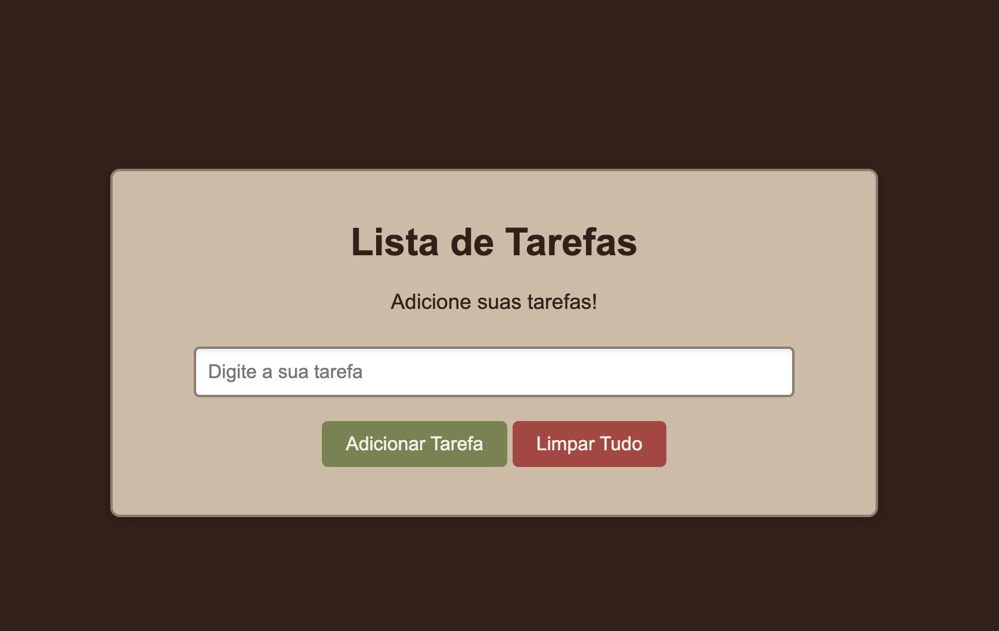

# Project: To-Do List with JavaScript

This project was developed following the lesson series "[JavaScript Course](https://www.youtube.com/playlist?list=PLhkO7OMKgT_rRK3qvJsZAy3jrkupOxD_h)" by [Rafaella Ballerini](https://github.com/rafaballerini).

## 🧠 About

This project is a simple **To-Do List** created with **JavaScript, HTML and CSS**, where the user can:
- Add tasks
- Edit tasks
- Remove individual tasks
- Clear the entire list

It was developed as part of a JavaScript learning journey, focused on applying logic and working with the DOM.

## 🛠 Technologies used

- HTML5  
- CSS3  
- JavaScript (Vanilla)

## 🚀 How to run the project

1. Clone or download the repository  
2. Open the `index.html` file in your browser  
3. Interact with the task input field to add, edit or remove tasks

## 🎯 Main learnings

- Arrays and data manipulation (`push`, `splice`)  
- DOM manipulation with `createElement`, `appendChild`, `textContent`, etc.  
- Event handling with `onclick`  
- Validating input and updating the interface dynamically  
- Understanding control structures like `if/else` and `for` loops

## ⚠️ Personal Note

The first lessons were easy to follow and helped reinforce basic concepts. However, the later classes (especially parts 4 and 5) became more challenging, requiring rewatching and extra attention to fully understand the logic behind the code. Despite the difficulty, the learning was valuable and rewarding.

## 👩‍💻 Credits

Project based on content by [Rafaella Ballerini](https://www.youtube.com/@RafaellaBallerini)  
GitHub repository: [Rafaela Ballerini GitHub](https://github.com/rafaballerini)
